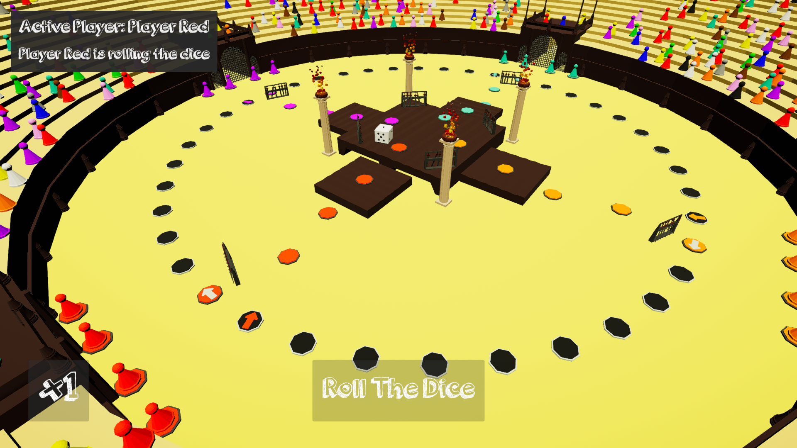
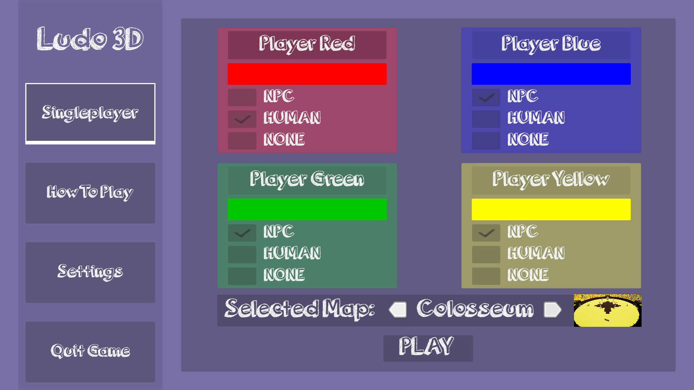

# Ludo3D
This is my first ever game created in Unity as part of an internship at Politechnika Częstochowska.

# Description
The goal of this project was to create a game that takes a simple board game like Ludo, add customisation options and allow players to take their gameplay into diffrent interesting locations.

# How to play
To start the game you have to go into Build folder and open Ludo3D.exe file (red stone icon).

As this is my first ever game and I was still learning, the language option might not work properly (mixed Polish and English languages).
To fix this go to Settings -> Change Language -> Select language you prefer.

If you have never played Ludo there is a "How To Play" button in main menu explaining the rules.

# Features
* Two playable maps
* Twelve diffrent player colors to chose from
* Ability to set the amount of players (2-4)
* Ability to select player type (Human/AI)
* Ability to set a player name
* Two supported languages (PL, EN)

# Preview
### Map: Cabins

### Map: Colosseum

### Menu

