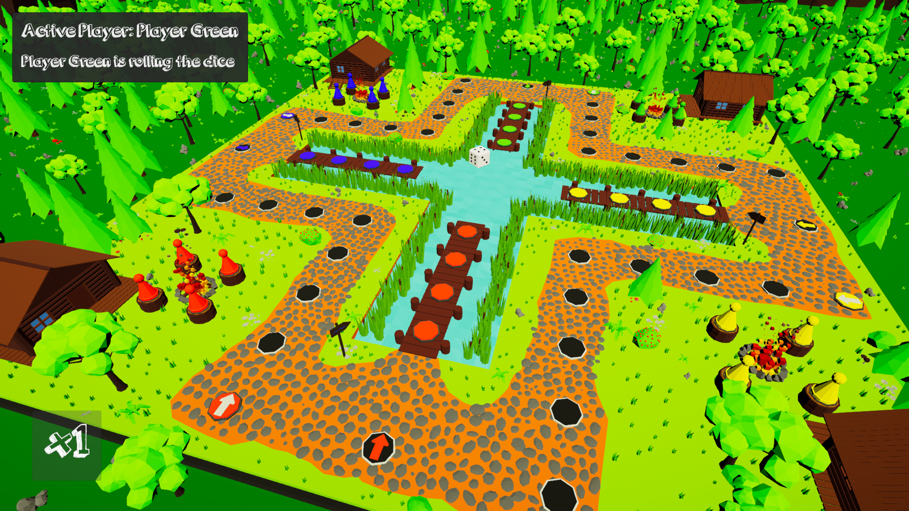

# Ludo3D
This is my first ever game created in Unity as part of an internship at Politechnika Częstochowska.

# How to play
To start the game you have to go into Build folder and open Ludo3D.exe file (red stone icon).

As this is my first ever game and I was still learning, the language option might not work properly (mixed Polish and English languages).
To fix this go to Settings -> Change Language -> Select language you prefer.

# Preview

